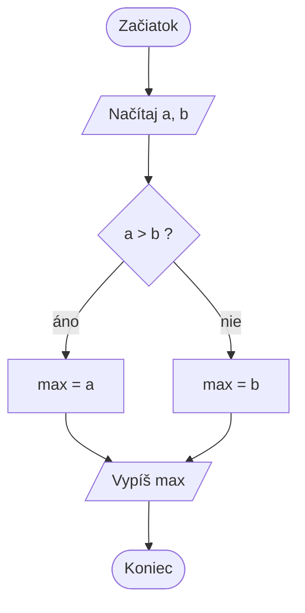

# T18 – Algoritmy, vývojové diagramy a VLSM

> [!info] Oficiálne znenie okruhu (PDF sylabus)
> ALGORITMY A ICH VLASTNOSTI, VÝVOJOVÉ DIAGRAMY - značky vývojového diagramu, redundancia na L2, EtherChannel, subneting VLSM

## Algoritmus a vývojový diagram

Algoritmus je presný, konečný a jednoznačný postup, ktorý z daných vstupov vytvorí požadovaný výstup. Má byť vykonateľný, správny, konečný a podľa potreby efektívny. Pri návrhu určujeme vstupy, výstupy, kroky, podmienky, opakovania a ukončenie.

Základné značky vývojového diagramu:

- ovál — začiatok alebo koniec,
- obdĺžnik — spracovanie/činnosť,
- rovnobežník — vstup alebo výstup,
- kosoštvorec — rozhodnutie s vetvami áno/nie,
- šípky — smer toku,
- spojovací symbol — prepojenie častí diagramu.

Diagram má mať čitateľný tok a každá vetva rozhodnutia musí viesť k ďalšiemu kroku alebo ukončeniu. Pri cykle je dôležité, aby sa menila podmienka, inak vznikne nekonečné opakovanie.

## Redundancia na L2

Redundancia znamená viac fyzických spojení alebo zariadení, aby výpadok jednej cesty neodstavil sieť. Na druhej vrstve však paralelné linky vytvoria slučku: rámce sa môžu neustále replikovať, MAC tabuľka sa bude meniť a vznikne broadcastová búrka. **STP** zvolí koreňový bridge, vypočíta cenu ciest a blokuje nadbytočné porty. **RSTP** skracuje čas rekonvergencie; MSTP môže mapovať viac VLAN do inštancií.

## EtherChannel

EtherChannel (link aggregation) združí viac fyzických ethernetových liniek do jedného logického port-channelu. Zvyšuje dostupnosť a súhrnnú kapacitu a STP ho vidí ako jednu linku. Príklad v štýle Cisco IOS:

```text
interface range GigabitEthernet0/1-2
 channel-group 1 mode active
interface Port-channel1
 switchport mode trunk
 switchport trunk allowed vlan 10,20
```

`mode active` používa LACP; `PAgP` je vendorovo špecifická alternatíva. Členovia musia mať zhodný typ portu, rýchlosť, duplex, native a povolené VLAN. Overujeme `show etherchannel summary` a `show interfaces port-channel`.

## Subneting VLSM

VLSM (*Variable Length Subnet Mask*) umožňuje prideliť rôznym podsieťam rôzne prefixy, aby sa adresný priestor nemíňal na veľké rovnako široké bloky. Postup:

1. spísať podsiete podľa požadovaného počtu hostiteľov,
2. zoradiť ich od najväčšej,
3. pre každú zvoliť počet hostiteľských bitov `h`, aby `2^h - 2` pokrylo hostiteľov,
4. prideliť zarovnaný blok a pokračovať od nasledujúcej adresy,
5. overiť sieťovú adresu, rozsah, broadcast a že sa bloky neprekrývajú.

Pre `192.168.10.0/24` a potreby 100, 50, 20 a 10 hostiteľov môže byť návrh:

| Potreba | Prefix | Sieť | Použiteľné adresy | Broadcast |
|---:|---:|---|---|---|
| 100 | `/25` | `192.168.10.0` | `.1 – .126` | `.127` |
| 50 | `/26` | `192.168.10.128` | `.129 – .190` | `.191` |
| 20 | `/27` | `192.168.10.192` | `.193 – .222` | `.223` |
| 10 | `/28` | `192.168.10.224` | `.225 – .238` | `.239` |

Zvyšný priestor `.240 – .255` ostáva na ďalšie zarovnané podsiete. Pri point-to-point linke môže byť podľa technológie vhodný aj `/31`; vždy treba zohľadniť pravidlá konkrétneho zariadenia.

## Príklad vývojového diagramu – väčšie z dvoch čísel



Rovnaký algoritmus v C#:

```csharp
int a = int.Parse(Console.ReadLine());
int b = int.Parse(Console.ReadLine());
int max = (a > b) ? a : b;
Console.WriteLine(max);
```

Cyklus vo vývojovom diagrame sa kreslí ako rozhodnutie, z ktorého šípka
vedie späť pred telo cyklu (napr. súčet čísel 1 až n: `i = 1`, `s = 0` →
`i <= n?` → `s = s + i`, `i = i + 1` → späť na podmienku).

Základné **algoritmické konštrukcie**: postupnosť (sekvencia), vetvenie
(podmienka) a cyklus (opakovanie).

## EtherChannel – režimy vyjednávania

| Protokol | Režimy | Kanál vznikne pri |
| --- | --- | --- |
| **LACP** (IEEE 802.3ad, otvorený) | `active`, `passive` | active–active, active–passive |
| **PAgP** (Cisco) | `desirable`, `auto` | desirable–desirable, desirable–auto |
| bez protokolu | `on` | on–on |

`passive–passive` ani `auto–auto` kanál nevytvorí – nikto nezačne vyjednávať.
Do jedného kanála možno spojiť až **8 aktívnych** portov. Prevádzka sa
rozdeľuje podľa MAC alebo IP adries (*load balancing*), jeden tok ide vždy
jednou linkou.

## Druhý príklad VLSM – s linkami medzi routermi

Sieť `172.16.0.0/24`, potreby: LAN A 60 hostí, LAN B 28 hostí, 2 linky medzi routermi.

| Podsieť | Hostí | Prefix | Sieť | Rozsah | Broadcast |
| --- | --- | --- | --- | --- | --- |
| LAN A | 60 | /26 | 172.16.0.0 | .1 – .62 | .63 |
| LAN B | 28 | /27 | 172.16.0.64 | .65 – .94 | .95 |
| linka R1–R2 | 2 | /30 | 172.16.0.96 | .97 – .98 | .99 |
| linka R2–R3 | 2 | /30 | 172.16.0.100 | .101 – .102 | .103 |

Postup: najprv najväčšia podsieť, ďalšia začína hneď za broadcastom
predchádzajúcej. Linky medzi routermi dostávajú `/30` (2 použiteľné adresy).

## Krátka ústna odpoveď

Algoritmus je konečný a jednoznačný postup; vo vývojovom diagrame ovál znamená začiatok/koniec, obdĺžnik činnosť, rovnobežník vstup/výstup a kosoštvorec rozhodnutie. Redundantné L2 linky vytvárajú slučky, preto ich riadi STP/RSTP. EtherChannel združuje porty do jedného logického kanála pomocou LACP alebo PAgP. VLSM prideľuje rôzne prefixy podľa počtu hostiteľov a bloky musia byť zarovnané a neprekrývať sa.

## Súvisiace poznámky (CCNA2)

[[M05 – STP Concepts]] · [[M06 – EtherChannel]] — rozcestník [[CCNA2 – SRWE]]

## Pozri aj – CCNA3 ENSA

- [[ENSA 11 – Návrh siete]]

## Kontrolné otázky

> [!question]- Čo je algoritmus a aké má vlastnosti?
> Konečný, jednoznačný postup z elementárnych krokov, ktorý pre vstup dá
> výsledok. Vlastnosti: konečnosť, jednoznačnosť, hromadnosť, rezultatívnosť,
> elementárnosť, efektívnosť.

> [!question]- Aké značky má vývojový diagram?
> Ovál – začiatok/koniec, obdĺžnik – spracovanie, rovnobežník – vstup/výstup,
> kosoštvorec – rozhodnutie, šípky – tok, krúžok – spojka.

> [!question]- Prečo je redundancia na L2 problém a ako sa rieši?
> Vznikajú slučky: broadcastové búrky, nestabilná MAC tabuľka, duplicitné rámce.
> Rieši sa STP/RSTP (blokovanie portov) alebo EtherChannel.

> [!question]- Čo je EtherChannel a aké má výhody?
> Spojenie viacerých fyzických liniek do jednej logickej. Väčšia šírka pásma,
> redundancia, STP neblokuje jednotlivé linky, jednoduchšia konfigurácia.

> [!question]- Ktoré kombinácie režimov LACP a PAgP vytvoria kanál?
> LACP: active–active, active–passive. PAgP: desirable–desirable,
> desirable–auto. Bez protokolu on–on.

> [!question]- Čo musia mať porty v EtherChannel zhodné?
> Rýchlosť, duplex, režim (access/trunk), VLAN, native VLAN a povolené VLAN.

> [!question]- Opíš postup VLSM.
> Zoradiť podsiete od najväčšej, každej zvoliť najmenší vyhovujúci prefix
> (`2^h − 2 ≥ hostí`), prideľovať bloky za sebou bez prekrytia, nakoniec linky /30.

> [!question]- Aký prefix zvolíš pre 50 hostí?
> `/26` (62 hostí); `/27` má len 30.
